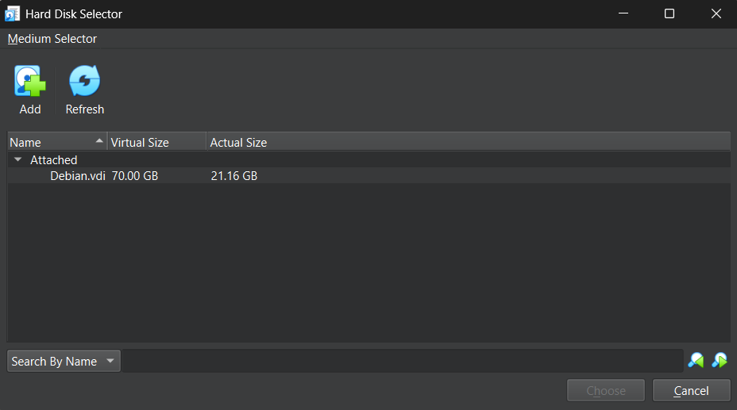

# Debiantration
Debiantration is a linux based distro which is based on Debian 12 and contains all of the tools that a penetration tester can use for testing the security of web applications.

# Getting Started
## Installing The vdi

You can donwload the .vdi file from the following link. 

To get started with the step you first have to download a virtualization software such as Oracle Virtualbox. Once you have downlaoded the virtualbox software click on the **New** button and allocate names and resources to your virtual machine. Once you get to the hard disk section 

Choose the second option **Use an Exsisting Virtual Hard Disk File** and than click on the yellow folder icon.

After clicking the yellow folder icon an external page will open click on the **Add** button and go to the folder where the vdi is stored.


Everything is setup now.
**Note Password is "debian". Same as username**

# Softwares Installed
## Web Penetration Softwares
The following web penetration softwares are installed on the system.
1. Burp Suite – A powerful web vulnerability scanner and proxy for intercepting and manipulating HTTP/S traffic.
2. WPScan – A tool to scan WordPress sites for known vulnerabilities in plugins, themes, and core files.
3. Gobuster / FFUF – Fast directory and file brute-forcers used for discovering hidden web content.
4. Nikto – Scans web servers for outdated software, insecure files, and misconfigurations.
5. SQLMap – Automates the detection and exploitation of SQL injection vulnerabilities.
6. WhatWeb – Identifies technologies used on websites, like servers, CMSs, and frameworks.
7. Wapiti – A black-box web application scanner that finds common vulnerabilities like XSS and SQLi.
8. Dirb – Uses a wordlist to brute-force directories and files on a web server.
9. Cadaver – A command-line WebDAV client used to test file upload and access issues.
10. Skipfish – A fast web application scanner that performs crawling and vulnerability detection.
11. WebScarab – An intercepting proxy for manually analyzing and modifying web traffic.
12. Davtest – Tests WebDAV-enabled servers for file upload and execution vulnerabilities.
13. Webshells – Scripts used to gain remote access and execute commands on compromised web servers.
14. Commix – A tool that automates the exploitation of command injection vulnerabilities.
15. DirBuster – A GUI-based brute-force tool for finding hidden directories and files on web apps.

To get more information you can run the following commands
```bash
    [commandName] -h 
    man [commandName]
    tldr [commandName]
```
Replace [commandName] with the actual command.


## Non Penetration Softwares
1. btop - A terminal based task manager to check your resources etc.
2. batcat - A better version of the cat software. 
3. docker - A container software for running things inside of a virtual enviroment.
4. katoolin 3 - A software that is used for installing those kali linux tools that are not included in the debian repository.

**Note: Commands docker and katoolin 3 require administrative priveliges please run as sudo**

# DWA (Damn Vulnerable Web App)
We have also included a Vulnerable Webiste known as Damn Vulnerable Web App which will run on your localhost so that you can test your Web Penetration Skills without getting into any trouble.

**Before getting started DWA is a vulnerable web app please don't run this on your actual machine and when you want to run this website please choose Nat Network in the Networks option. We won't be responsible for anything that happens to your machine.**

## Running the Web App.
For running the web app please run the following commands
```bash
    cd DVWA
    docker-compose up -d
```
This will run your vulnerable website on localhost:4280 you will get to a login page where it will ask for your username and password. Username is "admin" and password is "password". Once you login you will get a page that looks exactly like the image down below.


To close the connection run the following command.
```bash
    docker-compose down
```

# Using Katoolin 3
Katoolin 3 is a software that will give you the abillity to download any software that is not present in your debian repository. To run katoolin 3 please run the following command
```bash
    sudo katoolin3
```
Once you run this you will get a page like the one shown in the example below. Do as the software says and download your tool.


**Note: For obvious reasons do not update your system when katoolin3 is opened**
